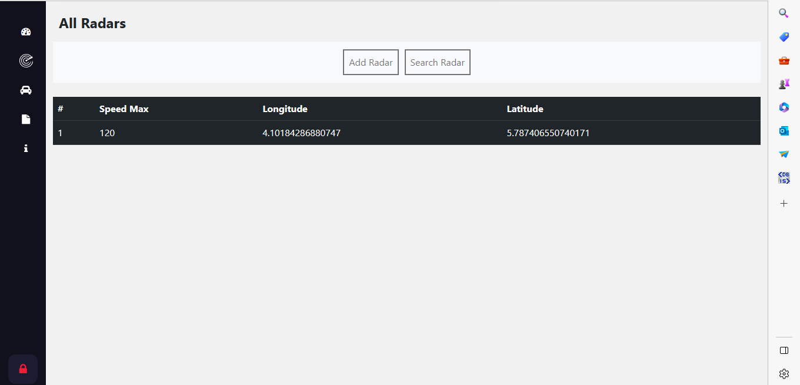

# Radar Violation Detection

This project talk about Radar System there are two part : backend :Spring - microservices and the side of the front : Angular 16
# Getting Started
## 📚Prerequisite


``` 

* Spring Cloud
* Eureka Descovery
* H2DataBase
* BloomRPC
```
# General Schema of the project


# Diagram class 

# Web Services  Structure (Backend)
There are five services in all, as stated in the project schema. Every one has a building plan.

## Radar Services
```
the radar management microservice The ID of a radar identifies it.
Latitude and Longitude are the coordinates and maximum speed
```
```

C:.                                      
├───.idea                                
├───.mvn                                 
│   └───wrapper                          
├───src                                  
│   ├───main                             
│   │   ├───java                         
│   │   │   └───org                      
│   │   │       └───sid                  
│   │   │           └───radarmicroservice
│   │   │               ├───Entities     
│   │   │               ├───Repository
│   │   │               └───web       
│   │   └───resources                 
│   │       ├───graphql               
│   │       ├───static
│   │       └───templates
│   └───test
│       └───java
│           └───org
│               └───sid
│                   └───radarmicroservice
└───target
    ├───classes
    │   └───org
    │       └───sid
    │           └───radarmicroservice
    │               ├───Entities
    │               ├───Repository
    │               └───web
    └───generated-sources
        └───annotations

```
## Violation Services
```
The micro-service that helps to deal with infringements. Each offence is defined by its ID, its date,
the radar number that detected the exceeding, vehicle registration, vehicle speed,maximum radar speed
and the amount of the infringement.
```

```
C:.                              
├───.idea
├───.mvn
│   └───wrapper
├───src
│   ├───main
│   │   ├───java
│   │   │   └───org
│   │   │       └───sid
│   │   │           └───infractionmicroservice
│   │   │               ├───Entities
│   │   │               ├───Repository
│   │   │               └───web
│   │   └───resources
│   │       ├───graphql
│   │       ├───static
│   │       └───templates
│   └───test
│       └───java
│           └───org
│               └───sid
│                   └───infractionmicroservice
└───target
    ├───classes
    │   └───org
    │       └───sid
    │           └───infractionmicroservice
    │               ├───Entities
    │               ├───Repository
    │               └───web
    └───generated-sources
        └───annotations


```
## Registration Services
```
The micro-registration service that allows the management of vehicles belonging to the
and owners. Each vehicle belongs to one owner. A owner is defined by his id, name, date of birth, email and email.
A vehicle is defined by its ID, registration number, brand, tax power and model.
```
```
C:.                              
├───.idea
│   └───libraries
├───.mvn
│   └───wrapper
├───src
│   ├───main
│   │   ├───java
│   │   │   └───org
│   │   │       └───sid
│   │   │           └───microserviceimmatri
│   │   │               ├───dto
│   │   │               ├───Entities
│   │   │               ├───mappers
│   │   │               ├───Repository
│   │   │               ├───Service
│   │   │               └───web
│   │   │                   ├───graphQl
│   │   │                   ├───rest
│   │   │                   └───soap
│   │   └───resources
│   │       ├───graphql
│   │       ├───static
│   │       └───templates
│   └───test
    │               ├───Repository
    │               ├───Service
    │               └───web
    │                   ├───graphQl
    │                   ├───rest
    │                   └───soap
    └───generated-sources
        └───annotations


```
## Eureka Discovery && Registry

```
in this section the microservices registre and when a client send a request to these microservices , the gateway subscribe in this registry then knows their addreses IP
```
```

C:.                              
├───.idea
│   └───libraries
├───.mvn
│   └───wrapper
├───src
│   ├───main
│   │   ├───java
│   │   │   └───org
│   │   │       └───sid
│   │   │           └───eureukadiscovery
│   │   └───resources
│   └───test
│       └───java
│           └───org
│               └───sid
│                   └───eureukadiscovery
└───target
    ├───classes
    │   └───org
    │       └───sid
    │           └───eureukadiscovery
    └───generated-sources
        └───annotations


```
## Gateway
```
refers to a device or software component that serves as an entry point or interface between two different networks. It acts as a translator, facilitating communication and data transfer between networks with different protocols, architectures, or communication technologies

```

```
C:.                              
├───.idea
├───.mvn
│   └───wrapper
├───src
│   ├───main
│   │   ├───java
│   │   │   └───org
│   │   │       └───sid
│   │   │           └───gateway
│   │   └───resources
│   └───test
│       └───java
│           └───org
│               └───sid
│                   └───gateway
└───target
    ├───classes
    │   └───org
    │       └───sid
    │           └───gateway
    └───generated-sources
        └───annotations

```

## Web Services Test

### Rest API
#### Swagger


## Test microservices With Rest API

## Rest API and Eureka 

<table align="center">
    <tr>
        <th>Eureka Discovery</th>
    </tr>
    <tr>
        <td></td>
    </tr>
</table>

<table align="center">
    <tr>
        <th>Registration WS</th>
        <th>Radars WS</th>
        <th>Violation WS</th>
    </tr>
    <tr>
        <td></td>
        <td></td>
        <td></td>
    </tr>
</table>


## Front End 

<table align="center">
    <tr>
        <th>Wlecome Page</th>
        <th>Login Page</th>
    </tr>
    <tr>
        <td></td>
        <td></td>
    </tr>
</table>
<table align="center">
    <tr>
        <th>Dashbord Page</th>
        <th>About Page</th>
    </tr>
    <tr>
        <td></td>
        <td></td>
    </tr>
</table>
<table align="center">
    <tr>
        <th>All Cars Page </th>
        <th>Add Car Page</th>
        <th>Del Car Page</th>
        <th>Search Car</th>
    </tr>
    <tr>
        <td></td>
        <td></td>
        <td></td>
        <td></td>
    </tr>
</table>

<table align="center">
    <tr>
        <th>Downlod Violation PDF</th>
       
    </tr>
    <tr>
        <td></td>
       
    </tr>
</table>


